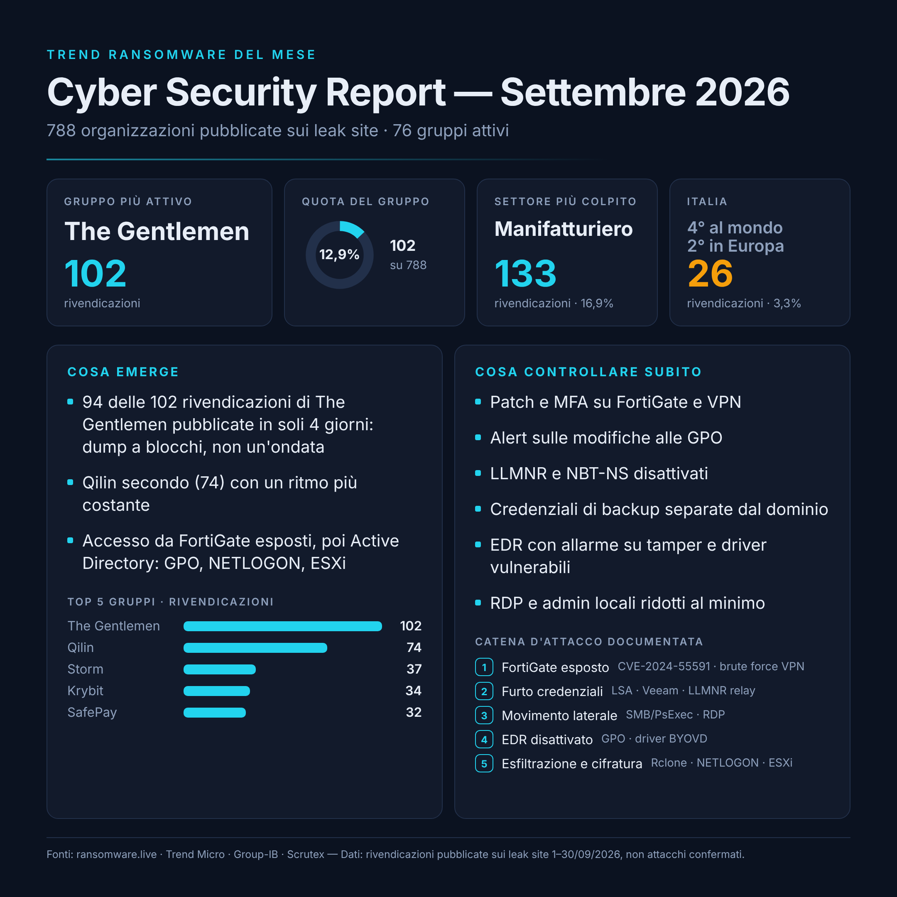

# Cyber Security Report — Settembre 2026

**Gruppo analizzato:** The Gentlemen
**Periodo:** rivendicazioni pubblicate sui leak site dall'1 al 30 settembre 2026
**Dati estratti il:** 2 ottobre 2026

| File | Contenuto |
|---|---|
| [`Exposure-Check.ps1`](Exposure-Check.ps1) | Script PowerShell read-only per verificare le configurazioni |
| [`chart-data.json`](chart-data.json) | Dati dei grafici in formato JSON |
| [`infographic.png`](infographic.png) | Infografica del mese |

---

## In sintesi

A settembre 2026 ransomware.live ha registrato **788 organizzazioni pubblicate sui leak site** da **76 gruppi**.

- Il gruppo con più rivendicazioni è **The Gentlemen**: 102, pari al **12,9%**.
- Al secondo posto c'è **Qilin** con 74 (9,4%), primo ad agosto secondo NCC Group e Bitdefender.
- Il settore più colpito è il **manifatturiero**: 133 rivendicazioni (16,9%).
- L'**Italia** conta **26 rivendicazioni** (3,3%): 4° paese al mondo a pari merito con il Brasile, 2° in Europa dopo la Germania. The Gentlemen e AuditTeam sono i gruppi più presenti sull'Italia (5 ciascuno).

Tutti i numeri sono **rivendicazioni pubblicate**, non attacchi confermati.

## Nota di metodo

- **Pubblicazione a blocchi.** 94 delle 102 rivendicazioni di The Gentlemen sono comparse in 4 giorni: 7/9 (19), 15/9 (30), 26/9 (20), 30/9 (25). È un andamento tipico della pubblicazione di arretrati, non di 30 intrusioni nello stesso giorno.
- **Le fonti non concordano su tutto.** Per la settimana 14–20/9 Scrutex indica Qilin al primo posto (31), mentre su ransomware.live The Gentlemen pubblica 30 rivendicazioni il solo 15/9. Le differenze dipendono da deduplica e attribuzione.
- **Criterio di data.** Si conta la data di **pubblicazione** sul leak site, non la data stimata dell'attacco. Con l'altro criterio i numeri cambiano.
- **Dati recenti.** A pochi giorni dalla fine del mese i tracker possono ancora aggiungere rivendicazioni.

## Numeri verificati

| Metrica | Valore | Fonte |
|---|---|---|
| Totale rivendicazioni pubblicate (1–30/9) | 788 | ransomware.live |
| Gruppi attivi | 76 | ransomware.live |
| Gruppo più attivo | The Gentlemen — 102 | ransomware.live |
| Quota del gruppo | 102 / 788 = 12,9% | calcolo |
| Secondo gruppo | Qilin — 74 (9,4%) | ransomware.live |
| Settore più colpito | Manifatturiero — 133 (16,9%) | ransomware.live |
| Italia | 26 (3,3%) | ransomware.live |
| Rivendicazioni senza paese | 82 | ransomware.live |
| Cross-check 7–13/9 | 179 vittime; primo The Gentlemen (21) | Scrutex |
| Cross-check 14–20/9 | 221 vittime; primo Qilin (31); Italia 9 | Scrutex |

## Come opera The Gentlemen

RaaS comparso nell'estate 2025 e cresciuto rapidamente nel 2026. Le tecniche che seguono sono documentate da Trend Micro e Group-IB.

- **Accesso iniziale**: FortiGate esposti su Internet. Sfruttamento di CVE-2024-55591, brute force sulle VPN, credenziali valide.
- **Furto di credenziali**: LSA secrets, credenziali Veeam e del browser, LLMNR/NBT-NS poisoning con SMB relay.
- **Ricognizione**: Nmap, Advanced IP Scanner, enumerazione di Domain Admins ed Enterprise Admins.
- **Movimento laterale**: SMB/PsExec e RDP.
- **Escalation**: account Domain Admin compromessi, modifica delle GPO.
- **Persistenza**: AnyDesk.
- **Elusione delle difese**: disattivazione di Defender/EDR via GPO e registro, driver vulnerabili firmati (BYOVD), cancellazione di log.
- **Esfiltrazione**: Rclone via SFTP, WinSCP.
- **Impatto**: cifratura di Windows, Linux ed ESXi, distribuita a tutto il dominio tramite la share NETLOGON; stop dei servizi di backup.

## MITRE ATT&CK

| Tattica | Tecnica | ID | Fonte |
|---|---|---|---|
| Initial Access | Exploit Public-Facing Application (CVE-2024-55591) | T1190 | Group-IB |
| Initial Access | Valid Accounts | T1078 | Trend Micro |
| Credential Access | Brute Force: Password Guessing | T1110.001 | Group-IB |
| Credential Access | OS Credential Dumping: LSA Secrets | T1003.004 | Group-IB |
| Credential Access | Credentials from Password Stores | T1555 | Group-IB |
| Credential Access | LLMNR/NBT-NS Poisoning and SMB Relay | T1557.001 | Group-IB |
| Discovery | Network Service Discovery | T1046 | Trend Micro |
| Discovery | Remote System Discovery | T1018 | Trend Micro |
| Discovery | Domain Account / Domain Groups Discovery | T1087.002 / T1069.002 | Trend Micro |
| Lateral Movement | SMB/Windows Admin Shares | T1021.002 | Trend Micro, Group-IB |
| Lateral Movement | Remote Desktop Protocol | T1021.001 | Trend Micro, Group-IB |
| Privilege Escalation | Domain Policy Modification: GPO | T1484.001 | Trend Micro, Group-IB |
| Privilege Escalation | Exploitation for Privilege Escalation (CVE-2024-37085) | T1068 | Group-IB |
| Persistence | Remote Access Software | T1219 | Trend Micro |
| Defense Evasion | Impair Defenses: Disable or Modify Tools | T1562.001 | Trend Micro, Group-IB |
| Defense Evasion | Impair Defenses: Disable or Modify Firewall | T1562.004 | Trend Micro |
| Defense Evasion | Modify Registry | T1112 | Trend Micro, Group-IB |
| Defense Evasion | Masquerading | T1036 | Group-IB |
| Exfiltration | Exfiltration Over Alternative Protocol | T1048 | Group-IB |
| Impact | Data Encrypted for Impact | T1486 | Trend Micro, Group-IB |
| Impact | Service Stop | T1489 | Trend Micro |
| Impact | Inhibit System Recovery | T1490 | Group-IB |

## Esposizione Internet (Shodan)

**Shodan data unavailable — values not included.**

---

## Exposure Check

Lo script [`Exposure-Check.ps1`](Exposure-Check.ps1) verifica sul singolo host le configurazioni collegate alle tecniche descritte sopra. Le istruzioni di download ed esecuzione sono nel [README principale](../../README.md#come-eseguirlo-passo-per-passo).

> Un esito "VERIFY" non significa che il sistema sia vulnerabile al ransomware The Gentlemen. Il sistema presenta configurazioni che meritano verifica rispetto alle tecniche osservate nel gruppo.

### Tecniche e controlli collegati

| Tecnica osservata | ATT&CK | Controllo nello script |
|---|---|---|
| Accesso via RDP, abilitato tramite registro | T1021.001 | RDP abilitato, NLA, membri Remote Desktop Users |
| Movimento laterale via SMB / PsExec | T1021.002 | SMBv1 |
| Modifica del firewall con netsh | T1562.004 | Profili firewall disabilitati |
| Disattivazione Defender/EDR | T1562.001 | Protezione AV/EDR attiva, Tamper Protection |
| BYOVD con driver firmati vulnerabili | T1562.001 / T1014 | Presenza di ThrottleBlood.sys, viragt64.sys |
| Sfruttamento di vulnerabilità | T1190 / T1068 | Età dell'ultimo hotfix |
| Account validi e privilegiati | T1078 | Membri del gruppo Administrators |
| Remote management | T1021.006 | Servizio WinRM |
| LLMNR/NBT-NS poisoning e SMB relay | T1557.001 | LLMNR disabilitato via policy |
| Esecuzione PowerShell | T1059.001 | Script Block Logging |
| Persistenza con strumenti RMM | T1219 | Servizi RMM/remote access installati |
| Furto credenziali Veeam, blocco ripristino | T1555 / T1490 | Presenza servizi Veeam |

### Pesi dello score

| Condizione | Punti |
|---|---|
| RDP abilitato | +10 |
| RDP senza NLA | +15 |
| SMBv1 abilitato | +20 |
| Almeno un profilo firewall disabilitato | +15 |
| Nessuna protezione AV/EDR real-time rilevata | +20 |
| Ultimo hotfix più vecchio della soglia (default 45 giorni) | +15 |
| Membri Administrators oltre la soglia (default 2) | +10 |
| WinRM in esecuzione | +5 |
| LLMNR non disabilitato | +5 |

Gli esiti `INFO`, `INVESTIGATE` e `UNKNOWN` valgono 0 punti.
0–19 LOW · 20–49 MEDIUM · 50+ HIGH

> Questo score non predice la probabilità di un attacco. Evidenzia configurazioni che richiedono attenzione.

### Controlli da fare fuori dall'endpoint

- **FortiGate / VPN**: firmware aggiornato (CVE-2024-55591), MFA su ogni accesso VPN, interfaccia di amministrazione non esposta.
- **Active Directory**: chi può modificare le GPO; alert sulle modifiche a GPO e alla share NETLOGON.
- **NBT-NS**: disattivarlo sulle schede di rete o via DHCP, non solo LLMNR.
- **Backup**: credenziali Veeam separate dal dominio, repository immutabile o offline.
- **VMware ESXi / vCenter**: patch (es. CVE-2024-37085), accesso amministrativo non legato ai gruppi AD.

---

## Fonti

- ransomware.live — API `/v2/victims/2026/09`: https://www.ransomware.live
- Trend Micro — *Unmasking The Gentlemen Ransomware*: https://www.trendaisecurity.com/en-us/resources-insights/trendai-security-blog/unmasking-the-gentlemen-ransomware
- Group-IB — *How Hastalamuerte Operates*: https://www.group-ib.com/blog/hastalamuerte-gentlemen-raas-ttps/
- Scrutex — weekly 7–13/9: https://scrutex.ai/blogs/ransomware-attacks-this-week-179-victims-across-44-groups-september-7-to-13-2026
- Scrutex — weekly 14–20/9: https://scrutex.ai/blogs/ransomware-attacks-this-week-221-victims-across-47-groups-september-14-to-september-20
- Industrial Cyber / NCC Group — agosto 2026: https://industrialcyber.co/ransomware/ransomware-activity-hits-2026-high-as-industrial-sector-bears-31-of-attacks-and-qilin-dominates
- Bitdefender — Threat Debrief settembre 2026: https://www.bitdefender.com/en-us/blog/businessinsights/bitdefender-ransomware-threat-debrief-september-2026
- MITRE ATT&CK: https://attack.mitre.org
